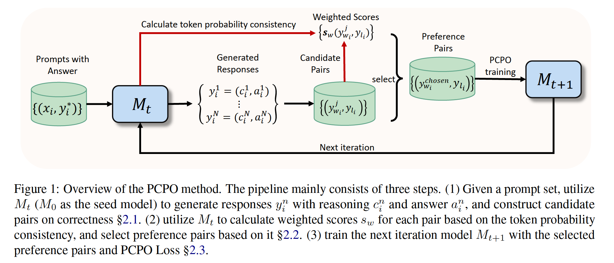

# Probability-Consistent Preference Optimization for enhanced LLM Reasoning

Recent advances in preference optimization have demonstrated significant potential for improving mathematical reasoning capabilities in large language models (LLMs). While current approaches leverage high-quality pairwise preference data through outcome-based criteria like answer correctness or consistency, they fundamentally neglect the internal logical coherence of responses. To overcome this, we propose Probability-Consistent Preference Optimization (PCPO), a novel framework that establishes dual quantitative metrics for preference selection: (1) surface-level answer correctness and (2) intrinsic token-level probability consistency across responses. Extensive experiments show that our PCPO consistently outperforms existing outcome-only criterion approaches across a diverse range of LLMs and benchmarks.

<p align="center">
    <br>
    
    <br>
</p>


## ⚙️ Install Requirements

We followed [alignment-handbook repo](https://github.com/huggingface/alignment-handbook) to bulid our code. You can do as follows to setup the training environment:

1. create a Python virtual environment using e.g. Conda:
```shell
conda create -n handbook python=3.10 && conda activate handbook
```

2. install PyTorch `v2.2.2`. Since this is hardware-dependent, you can access to the [PyTorch Installation Page](https://pytorch.org/get-started/locally/).

3. You can then install the remaining package dependencies of [alignment-handbook](https://github.com/huggingface/alignment-handbook) as follows:

```shell
git clone https://github.com/huggingface/alignment-handbook.git
cd ./alignment-handbook/
python -m pip install .
```

4. Flash Attention 2 should be installed for training, run:

```shell
python -m pip install flash-attn --no-build-isolation
```

5. install other required packages:
```shell
pip install -r requirements.txt
```

## 💻 Training Scripts

### Prompt Dataset
Our training data includes 7.5k GSM8K training set, 7.5k MATH training set, 7.5k subset of Orca-math, and 7.5k subset of Cn-k12, 30k in total. We provide them in the `./qwen-math/data` dir.


### PCPO Train
You can train the next iteration model using the script below:
```shell
ACCELERATE_LOG_LEVEL=info accelerate launch --config_file ./alignment-handbook/recipes/accelerate_configs/deepspeed_zero3.yaml ./scripts/run_pcpo.py ./yamls/train_example.yaml
```


## 💹 Evaluation
We followed [Qwen-math](https://github.com/QwenLM/Qwen2.5-Math/tree/main/evaluation) for evaluation

You can run the scripts followed as:
```shell
#Pass@1
bash ./scripts/test.bash model_path data_name
#Maj@8
bash ./scripts/test_maj.bash model_path data_name
```

